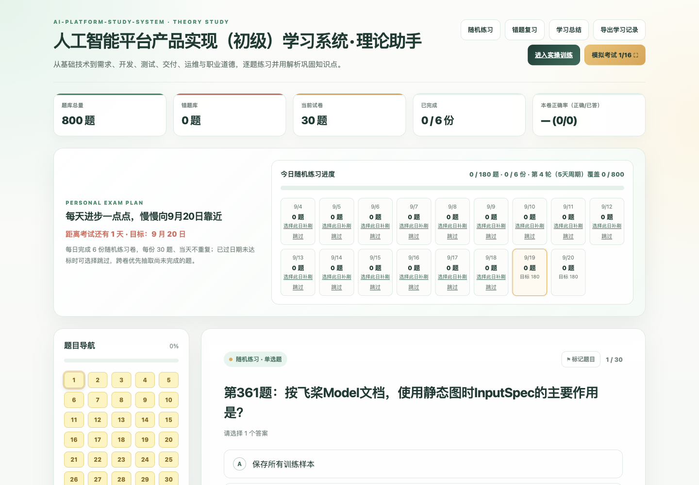
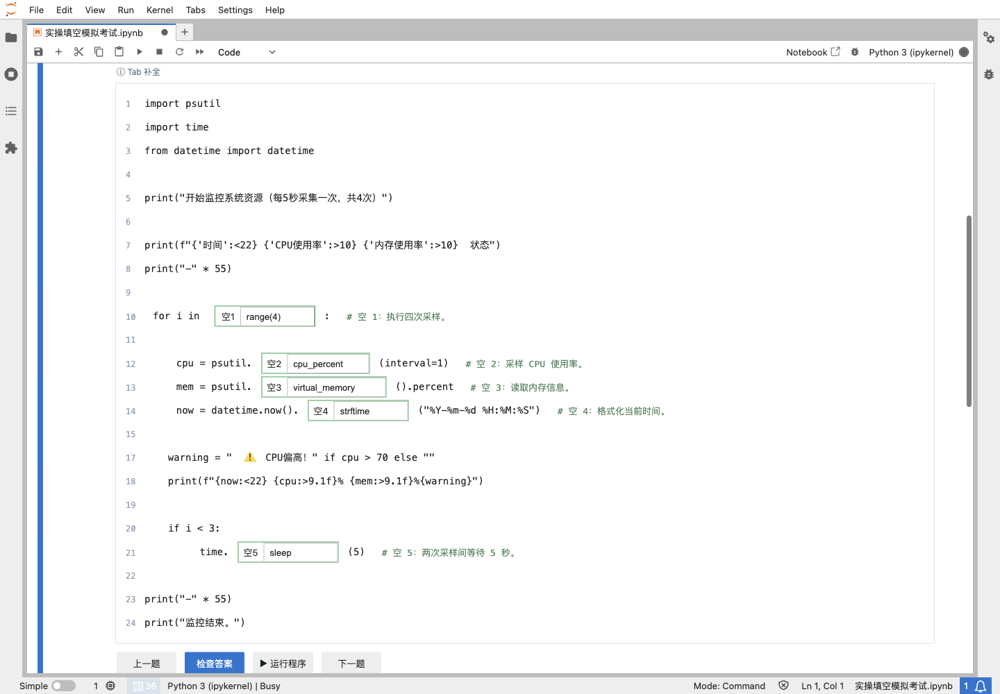
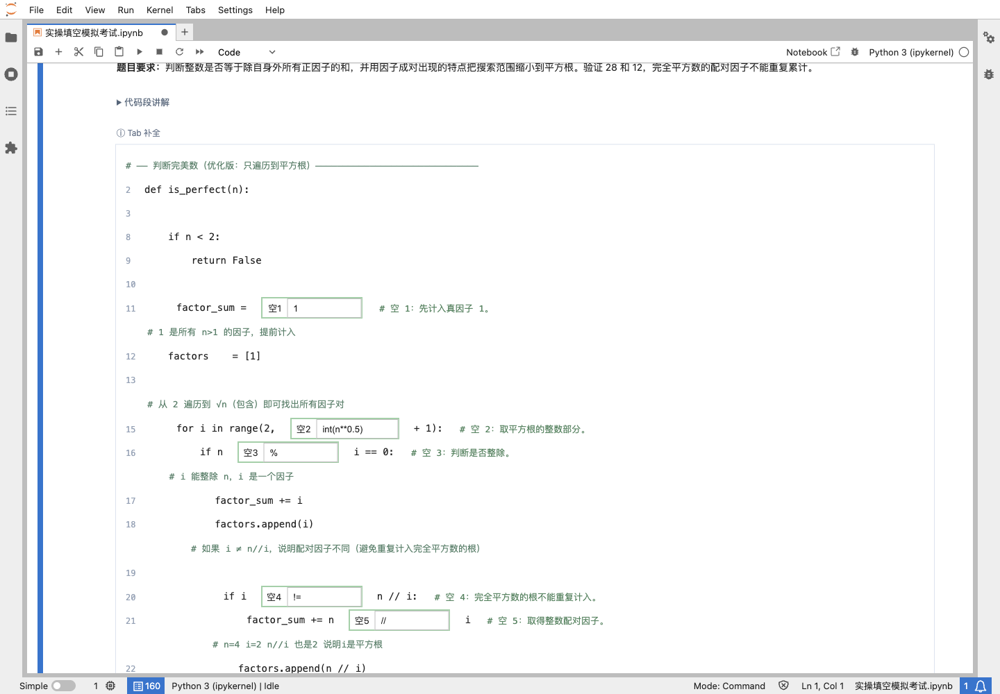
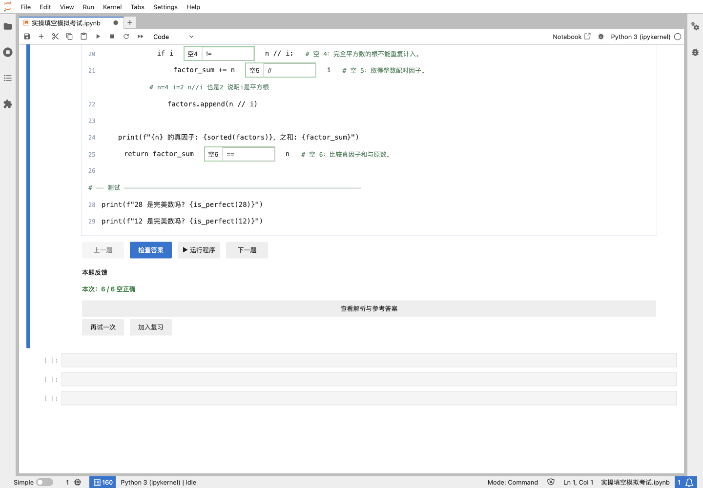

# 人工智能平台产品实现（初级）学习系统 · 公开展示

项目标识：`ai-platform-study-system-showcase`

这是“人工智能平台产品实现（初级）学习系统”的公开展示仓库，用于介绍项目目标、理论学习助手、页面结构、使用场景和界面效果。

**理论学习助手及其完整理论题集已在本仓库公开；完整实操题库、判分逻辑、JupyterLab Notebook 和个人学习记录继续保留在 Private 仓库。**

> <span style="color:#b91c1c"><strong><u>重要提醒：本项目是学习辅助工具，不代表官方考试题库或评分标准。</u></strong></span>
>
> 理论题和仿真题仅用于知识点复习、代码理解和答题方法训练，不能替代官方考试要求，也不能据此保证通过考试。

## 项目定位

系统面向中国大陆地区的人工智能工程技术人员（人工智能平台产品实现-初级）备考场景，形成“理论理解 → 实操填空 → JupyterLab 运行验证”的本地学习流程。

完整实操训练版本：

- Private 仓库：[ai-platform-study-system](https://github.com/13306518212/ai-platform-study-system)
- 访问方式：由维护者按需邀请指定 GitHub 账号

## 功能概览

- 理论学习助手：约 800 道理论题，包含知识梳理、题目练习、解析和学习记录。
- JupyterLab 实操训练：代码填空、Tab 补全、运行验证和逐空判分。
- 学习记录：今日练习、专项练习、错题复习和模拟考试。
- 学习导航：理论助手与实操 Notebook 之间互相跳转。
- 本地优先：完整训练版本的题库、判分和记录在本机运行。
- 实操公开样题：额外公开 13 道非“2026 年仿真题”样题，按 Python 5、Pandas 3、机器学习 1、系统运维 4 抽样。

## 页面与架构预览


### 理论学习助手



### JupyterLab 实操训练



### 代码注释与学习提示



### 填空提示与原生补全



## 实操公开样题

公开展示仓库提供 [13 道实操样题](practical-samples/README.md)，用于查看填空题干和代码形式。样题不含答案映射、完整原始代码和判分逻辑；完整实操训练仍在 Private 仓库。

## 直接体验理论学习助手

理论学习助手文件位于 [`theory/index.html`](theory/index.html)，下载仓库后可直接在浏览器打开。

macOS / Linux：

```bash
open theory/index.html
```

Windows：双击 `theory/index.html`，或在浏览器中选择“打开文件”。

公开版本中的“申请实操训练访问”入口会指向完整训练仓库；没有权限的用户无法查看 Private 仓库内容。

## 公开仓库与完整仓库的边界

本仓库公开：

- 完整理论学习助手及其理论题集；
- 理论题所需的本地辅助映射文件；
- 项目说明、系统架构图和界面截图。

完整实操训练仓库保留：

- 完整 70 道实操题库及答案；
- 实操 Notebook、判分逻辑和启动模块；
- 个人学习记录、运行时文件和备份；
- 未确认可再分发的实操参考材料。

这样可以公开理论学习入口，同时限制实操题库、答案和个人数据的传播范围。

## 如何申请完整实操版本

如需使用完整实操训练系统，请先说明用途并提供 GitHub 用户名，由维护者逐人授权。获得访问权限后，按照 Private 仓库 README 的“快速开始”章节安装 Python、JupyterLab 和项目依赖。

## 内容与法律说明

- 本项目不是官方考试平台，也不代表任何考试组织、培训机构或题库平台。
- “2026 年仿真题”是作者参加考试后，根据个人记忆、答题情况和复习材料，经 AI 辅助并由人工整理生成的学习材料，不是官方完整试卷，不保证与实际考试 100% 一致。
- 理论题及其说明公开前，维护者应确认拥有相应的整理、改编和再分发权限；第三方教材、试卷、商标和参考材料的权利归原权利人所有。
- 如发现内容涉及侵权或不适合公开，请通过 [GitHub Issue](https://github.com/13306518212/ai-platform-study-system-showcase/issues) 联系维护者，说明具体文件和原因，以便核查、删除或更正。

公开展示内容的使用范围见 [CONTENT-LICENSE.md](CONTENT-LICENSE.md)，第三方内容说明见 [THIRD_PARTY_NOTICES.md](THIRD_PARTY_NOTICES.md)。

## 版本与状态

公开展示仓库与完整训练仓库相互独立。本仓库维护理论公开版和展示材料；完整训练仓库的 V1.0 版本已经封版，后续如需授权或维护，请以 Private 仓库中的说明为准。
