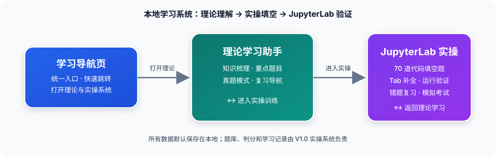

# 人工智能平台产品实现（初级）学习系统 · 公开版

[](https://github.com/13306518212/ai-platform-study-system-showcase/releases)
[](LICENSE)
[](requirements.txt)
[](https://jupyter.org/)

项目标识：`ai-platform-study-system-showcase`

这是面向中国大陆用户的本地学习系统，帮助学习者完成“理论理解 → 代码填空 → JupyterLab 运行验证 → 错题复习”的完整学习闭环。公开版包含完整理论学习助手，以及一套题量精简但功能完整的 JupyterLab 实操训练。

英文说明（辅助）：[README.en.md](README.en.md) · 在线入口：[GitHub Pages](https://13306518212.github.io/ai-platform-study-system-showcase/index.html)

## <span style="color:#b91c1c"><strong><u>⚠️ 重要提醒（请先阅读） ⚠️</u></strong></span>

> <span style="color:#b91c1c"><strong>本系统用于知识点复习、代码理解和答题方法训练，不能替代官方考试要求或评分标准。</strong></span>
>
> 系统中的部分练习采用关键词、表达式或局部代码填空；正式考试可能对完整语句、更长代码片段或不同上下文进行留空，留空位置和评分方式可能变化。
>
> <span style="color:#b91c1c"><strong><u>不要把记住关键词、某道题一次答对或系统显示“已掌握”当作通过考试的保证。</u></strong></span>
>
> 建议先说明代码要解决的问题，再理解输入、处理流程、返回值、异常分支和边界条件；随后逐步减少对 Tab 补全、提示和参考答案的依赖，进行独立默写、运行验证和限时练习。

## 项目定位

系统面向“人工智能工程技术人员（人工智能平台产品实现-初级）”学习场景，重点覆盖：

- Python 核心语法、函数、异常、面向对象和经典算法；
- Pandas / NumPy 数据读写、清洗、筛选和聚合；
- 机器学习基础、数据预处理、训练、预测和指标；
- 文件操作、JSON、网络请求、系统监控和运行验证；
- 理论题复习、实操填空、错题复测和模拟考试。

## 功能

- **理论学习助手**：完整理论题集、知识点说明、单选/多选/判断、随机练习、错题复习和模拟考试。
- **JupyterLab 实操训练**：公开版包含 13 道题、60 个填空位。
- **完整判分链路**：答案等价比较、语法检查、逐空判分、运行结果展示和错误定位。
- **原生环境练习**：使用 JupyterLab 原生代码单元、Tab 候选和 Output 输出区。
- **学习记录**：今日练习、专项练习、错题复习、模拟考试、首次答案、独立答题率和复测状态。
- **本地优先**：答题记录保存在本机，不依赖在线账号或在线判题服务。
- **中国区友好**：中文优先说明、Release 下载、SHA256 校验、国内 PyPI 镜像示例和离线理论页面。

## 快速开始

下面的步骤从“下载项目”开始，到“完成第一道题并看到运行结果”为止。第一次使用建议按顺序执行。

### 1. 获取项目

**方式 A：下载 Release（适合不熟悉 Git 的用户）**

1. 打开 [最新 Release](https://github.com/13306518212/ai-platform-study-system-showcase/releases/latest)。
2. 下载 `ai-platform-study-system-showcase-v1.0.0.zip`。
3. 参考同一 Release 中的 `SHA256SUMS.txt` 校验文件完整性。
4. 将压缩包解压到路径简单、可读写的目录，例如：

   ```text
   ~/Documents/ai-platform-study-system-showcase
   ```

**方式 B：使用 Git**

```bash
git clone https://github.com/13306518212/ai-platform-study-system-showcase.git
cd ai-platform-study-system-showcase
```

### 2. 确认 Python

项目需要 Python 3.9 或更高版本：

```bash
python3 --version
```

Windows PowerShell：

```powershell
py -3 --version
```

如果找不到命令，请从 [Python 官网](https://www.python.org/downloads/) 安装 Python，并在 Windows 安装时勾选“Add Python to PATH”。

### 3. 创建虚拟环境并安装依赖

#### macOS / Linux

```bash
python3 -m venv .venv
source .venv/bin/activate
python -m pip install --upgrade pip
python -m pip install -r requirements.txt
```

#### Windows PowerShell

```powershell
py -3 -m venv .venv
.\.venv\Scripts\Activate.ps1
python -m pip install --upgrade pip
python -m pip install -r requirements.txt
```

如果 PowerShell 阻止激活脚本：

```powershell
Set-ExecutionPolicy -Scope Process Bypass
.\.venv\Scripts\Activate.ps1
```

依赖检查：

```bash
python -c "import jupyterlab, ipykernel, ipywidgets, numpy, pandas, sklearn, psutil, requests; print('依赖安装正常')"
```

中国大陆网络环境下，如果默认 PyPI 下载较慢，可以临时使用可用的国内镜像：

```bash
python -m pip install -r requirements.txt -i https://pypi.tuna.tsinghua.edu.cn/simple
```

镜像服务状态和使用规则以服务提供方当前说明为准。

### 4. 启动理论学习助手

理论助手不依赖 JupyterLab：

- 直接双击 `theory/index.html`；或
- 打开在线入口：[GitHub Pages 理论助手](https://13306518212.github.io/ai-platform-study-system-showcase/theory/)。

理论题的学习记录保存在当前浏览器本地。

### 5. 启动实操训练

#### macOS

1. 在 Finder 中进入项目目录。
2. 双击 `practical/打开考试.command`。
3. 如果 macOS 阻止首次打开，右键文件选择“打开”。
4. 也可以在终端运行：

   ```bash
   chmod +x practical/打开考试.command
   python3 practical/start_jupyter.py --no-browser
   ```

#### Windows / Linux

在项目根目录执行：

```bash
python practical/start_jupyter.py --no-browser
```

看到“考试入口已就绪”后，在浏览器打开终端显示的地址：

```text
http://127.0.0.1:8889/lab/tree/practical/%E5%AE%9E%E6%93%8D%E5%A1%AB%E7%A9%BA%E6%A8%A1%E6%8B%9F%E8%80%83%E8%AF%95.ipynb
```

JupyterLab 启动脚本只监听本机，免密码和 token，不提供局域网远程访问。

### 6. 首次答题

1. 打开 `practical/实操填空模拟考试.ipynb`。
2. 运行顶部唯一启动单元（Shift + Enter）。
3. 点击“今日练习”或“专项练习”。
4. 点击代码空位输入答案；需要时按 Tab 请求 JupyterLab 原生候选。
5. 点击“检查答案”，再点击“运行程序”查看原生 Output 输出。
6. 查看解析和参考答案后，可以点击“再试一次”进行独立复测。

看到“本次：X / X 空正确”并且程序正常结束，说明当前题目的填空、内核和运行链路已经完成一次验证。

## 公开版实操题库

公开版共 13 道题、60 个填空位：

| 模块 | 题数 |
| --- | ---: |
| Python | 5 |
| Pandas | 3 |
| 机器学习 | 1 |
| 系统运维 | 4 |

公开版使用完整的题目数据、答案校验、语法检查、运行验证、学习记录、复测和模拟考试逻辑，启动后直接按普通实操系统使用。Private 完整训练仓库仅增加题目数量和内部维护材料。

## 推荐学习流程

1. 先使用理论助手理解知识点和代码目的。
2. 在专项练习中完成对应模块，先独立填写，再使用 Tab 或解析核对。
3. 点击“运行程序”，结合输出解释代码的实际效果。
4. 将错误题加入复习，隔日进行独立复测。
5. 关闭补全和参考答案，完成限时模拟考试。
6. 复习结果应与官方考试要求、教材和个人实际掌握情况交叉核对。

## 记录、隐私与重置

- 理论学习记录保存在浏览器本地。
- 实操记录保存在 Notebook 同目录的本机 JSON 文件。
- `.gitignore` 已排除答题记录、运行时文件、日志、缓存和备份。
- 分享项目之前，请确认没有把个人记录、Token、Cookie、API 密钥或私人路径加入 Git。
- 需要重新开始时，使用界面中的“清空记录”功能；不要手动删除正在运行的 Jupyter 状态目录。

## 常见问题

### 浏览器出现 `Password or token:`

关闭旧的 JupyterLab 页面，重新运行 `python practical/start_jupyter.py --no-browser`，并打开命令行输出的 `127.0.0.1:8889` 地址。不要使用其他 Jupyter 服务的旧地址。

### 端口 8889 被占用

关闭旧的 JupyterLab 服务或对应终端，再重新启动；不要同时运行多个不同目录的实操系统。

### Notebook 打开但没有题目界面

确认运行的是顶部启动单元，而不是只打开 Notebook；按 Shift + Enter 后等待几秒。

### 按钮没有反应

确认内核状态为 Idle，等待上一项运行结束；必要时使用 JupyterLab 的 Kernel → Restart Kernel，再重新运行启动单元。

### 运行程序没有输出

先检查填空语法，再运行程序；如果程序需要依赖，确认已在同一虚拟环境安装 `pandas`、`numpy`、`scikit-learn`、`requests` 和 `psutil`。

## 系统结构



| 模块 | 入口 | 作用 |
| --- | --- | --- |
| 在线/本地理论助手 | [`theory/index.html`](theory/index.html) | 理论刷题、解析、错题和模拟考试 |
| 实操系统 | [`practical/实操填空模拟考试.ipynb`](practical/%E5%AE%9E%E6%93%8D%E5%A1%AB%E7%A9%BA%E6%A8%A1%E6%8B%9F%E8%80%83%E8%AF%95.ipynb) | JupyterLab 代码填空、运行验证和模拟考试 |
| 学习说明 | [`practical/使用说明.md`](practical/%E4%BD%BF%E7%94%A8%E8%AF%B4%E6%98%8E.md) | 启动、答题、记录和故障处理 |

## 目录结构

```text
.
├── index.html
├── theory/
│   ├── index.html
│   ├── PDF页码-题目编号追踪表.csv
│   └── PDF页码-题目页码映射.js
├── practical/
│   ├── 实操填空模拟考试.ipynb
│   ├── notebook_app.py
│   ├── questions.json
│   ├── autocomplete.js
│   ├── kernel_guard.js
│   ├── start_jupyter.py
│   └── 打开考试.command
├── docs/screenshots/
├── .github/
├── requirements.txt
└── README.md
```

## 反馈与参与

欢迎使用中文提交：

- [问题反馈](https://github.com/13306518212/ai-platform-study-system-showcase/issues/new?template=bug_report.md)
- [题库勘误](https://github.com/13306518212/ai-platform-study-system-showcase/issues/new?template=question_correction.md)
- [功能建议](https://github.com/13306518212/ai-platform-study-system-showcase/issues/new?template=feature_request.md)

提交前请删除个人记录、Token、API 密钥和本地隐私路径。

## Private 完整训练仓库

[ai-platform-study-system](https://github.com/13306518212/ai-platform-study-system) 保留全量实操题库和内部维护材料，需要由维护者按需授权。公开版和 Private 版使用同一套实操系统逻辑，差异主要是题目数量。

## 许可证与内容说明

- Python、JavaScript、启动脚本和 Notebook 逻辑采用 [MIT License](LICENSE)。
- 原创说明文字、解析、架构图和截图的使用范围见 [CONTENT-LICENSE.md](CONTENT-LICENSE.md)。
- 第三方依赖、教材、试卷、商标和参考材料的权利归原权利人所有，见 [THIRD_PARTY_NOTICES.md](THIRD_PARTY_NOTICES.md)。
- 如发现内容涉及侵权或不适合公开，请通过 [GitHub Issue](https://github.com/13306518212/ai-platform-study-system-showcase/issues) 联系维护者，说明具体文件和原因，以便核查、删除或更正。

## 发布与引用

- 当前版本：[v1.0.0 Release](https://github.com/13306518212/ai-platform-study-system-showcase/releases/tag/v1.0.0)
- 下载时建议同时保存 `SHA256SUMS.txt` 并进行校验。
- 引用信息见 [`CITATION.cff`](CITATION.cff)。
- 更新记录见 [`CHANGELOG.md`](CHANGELOG.md)。

## 版本状态

本公开版以 v1.0.0 作为稳定封版版本。后续如需增加题目或功能，将通过新的版本和 Release 管理，不覆盖当前封版内容。
